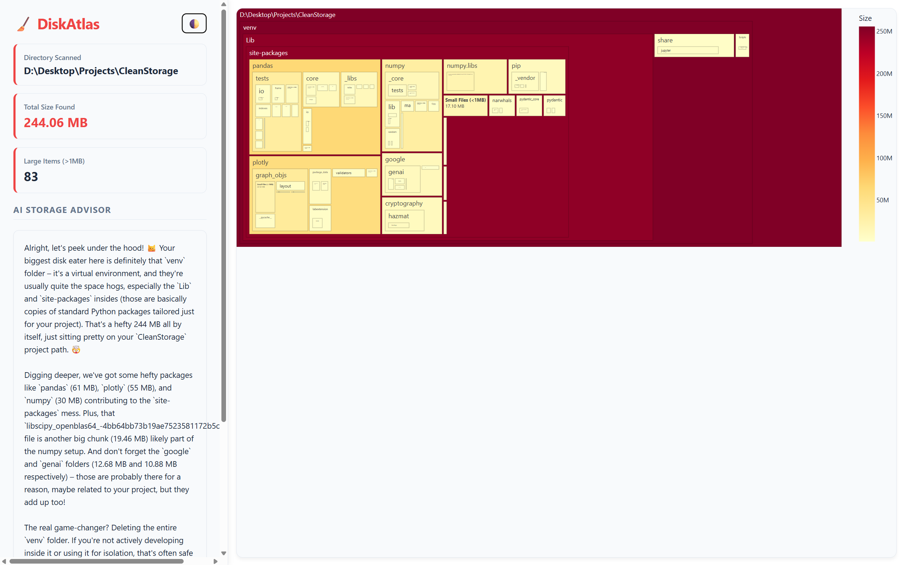

# DiskAtlas 🧹

> DiskAtlas is a lightweight, AI-powered disk visualizer. It safely scans your drives, generates beautiful interactive Plotly treemaps of your storage, and uses local or online AI models (Ollama/Gemini) to act as a relatable digital janitor, giving you personalized, snarky advice on what to clean up. Fully CLI-driven.



## 🚀 Features

- **Interactive Treemaps:** Visualize your entire drive with dynamic size formatting (MB/GB) using Plotly.
- **AI Storage Advisor:** Get personalized cleanup tips from AI (supports Google Gemini or Local Ollama).
- **Custom Model Selection:** Use `--ai-model` to bring your own local LLMs (e.g., `deepseek-r1:8b`, `llama3`).
- **Safe & Cross-Platform:** Automatically skips locked system files and works seamlessly on Windows, macOS, and Linux.

## 🛠️ Installation

1. **Clone the repository**
   ```bash
   git clone https://github.com/yourusername/DiskAtlas.git
   cd DiskAtlas
   ```

2. **Create a virtual environment (Recommended)**
   ```bash
   python -m venv venv
   # Windows:
   venv\Scripts\activate
   # macOS/Linux:
   source venv/bin/activate
   ```

3. **Install dependencies**
   ```bash
   pip install -r requirements.txt
   ```

## 💻 Usage

Run `DiskAtlas` directly from your terminal. It will generate a `disk_dashboard.html` file and open it in your browser.

```bash
# Basic scan of the current directory (ignores files under 100MB)
python disk_atlas.py

# Scan a specific drive and exclude folders
python disk_atlas.py --drive D:\ --min-size 50 --exclude node_modules .git OneDrive

# Scan multiple drives at once
python disk_atlas.py --drive C:\ D:\ --min-size 100
```

### 🧠 Using the AI Advisor
DiskAtlas can act as your personal digital janitor by analyzing your largest files.

**Option 1: Local AI (Privacy-First)**
*Requires [Ollama](https://ollama.com/) running locally.*
```bash
python disk_atlas.py --ai-advisor local --ai-model deepseek-r1:8b
```

**Option 2: Online AI (Google Gemini)**
*Requires a free API key from [Google AI Studio](https://aistudio.google.com/).*
```bash
# Set your API key first: export GEMINI_API_KEY="your_key"
python disk_atlas.py --ai-advisor online
```

## 📄 License
This project is licensed under the MIT License - see the [LICENSE](LICENSE) file for details.
